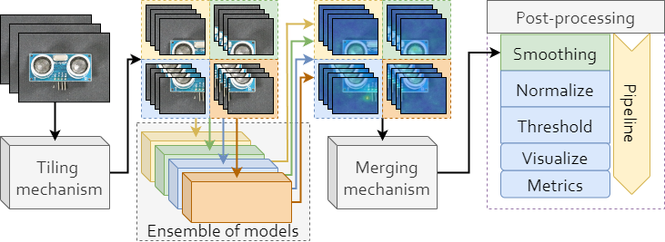

# Tiled ensemble

This tutorial will show you how to use **The Tiled Ensemble** ([Paper link](https://openaccess.thecvf.com/content/CVPR2024W/VAND/html/Rolih_Divide_and_Conquer_High-Resolution_Industrial_Anomaly_Detection_via_Memory_Efficient_CVPRW_2024_paper.html)).

The tiled ensemble approach reduces memory consumption by dividing the input images into a grid of tiles and training a dedicated model for each tile location.
The tiled ensemble is compatible with any existing anomaly detection model without the need for any modification of the underlying architecture.



TODO: rewrite for new v1 implementation

# Training

Training of tiled ensemble can be done with training script using the following command:

```{code-block} bash

python tools/tiled_ensemble/train_ensemble.py \
    --ensemble_config tools/tiled_ensemble/ens_config.yaml
```

By default padim model is trained on bottle category. Another model can be passed like in following example:

```{code-block} bash

python tools/tiled_ensemble/train_ensemble.py \
    --model fastflow \
    --ensemble_config tools/tiled_ensemble/ens_config.yaml
```

Or using a path to config:

```{code-block} bash

python tools/tiled_ensemble/train_ensemble.py \
    --model_config src/anomalib/models/padim/config.yaml \
    --ensemble_config tools/tiled_ensemble/ens_config.yaml

```

# Evaluation

To evaluate the trained tiled ensemble on test data, run the following script:

```{code-block} bash

python tools/tiled_ensemble/test_ensemble.py \
    --ensemble_config tools/tiled_ensemble/ens_config.yaml \
    --weight_folder path_to_weights

```

In this case, path to weights should be the one inside results, where checkpoints are saved. Usually that is inside `results/padim/mvtec/bottle/run/weights/lightning`.

Same as with training, `--model` or `--model_config` can be used.

# Ensemble configuration

Ensemble is configured using yaml file located inside `tools/tiled_ensemble` directory.

```{code-block} yaml

tiling:
    tile_size: 256
    stride: 256
```

Tiling section determines tile size and stride. Another important parameter is image_size from base model config file. It determines the original size of the image.
This image is then split into tiles, where each tile is of shape set by `tile_size` and tiles are taken with step set by `stride`.
Having image_size: 512, tile_size: 256, and stride: 256, results in 4 non-overlapping tile locations.

```{code-block} yaml

predictions:
    storage: memory # options: [memory, file_system, memory_downscaled]
    downscale_factor: 0.5
```

Predictions section determines how ensemble predictions are stored.
There are 3 options for storage:

- memory - predictions are stored in memory,
- file_system - predictions are stored in the file system,
- memory_downscaled - predictions are downscaled and stored in memory where `downscale_factor` determines downscaling.

More details about storage can be found in `prediction_data` docstrings.

```{code-block} yaml

post_processing:
    normalization: image # options: [tile, image, none]
    smooth_joins:
        apply: True
        sigma: 2
        width: 0.1
```

Post processing section determines how normalization and smoothing of tile joins is handled.

Predictions can either be normalized by each tile location separately (`tile` option), when all predictions are joined (`image` option), or normalization can be skipped (with `none` option).

There is an option to apply tile join smoothing, where `width` determines percentage of region around the join where smoothing by Gaussian filter with given `sigma` will be applied.

```{code-block} yaml

metrics:
    image:
        - F1Score
        - AUROC
    pixel:
        - F1Score
        - AUROC
    threshold:
        stage: image # options: [tile, image]
        method: adaptive #options: [adaptive, manual]
        manual_image: null
        manual_pixel: null
```

Metrics section overrides the one in model config. It works in the same way but in this case thresholding stage is also determined.
Thresholding is done during training tile wise in every case. But we can also re-do it once all the tiles are joined with `image` option.

```{code-block} yaml

visualization:
    show_images: False # show images on the screen
    save_images: True # save images to the file system
    image_save_path: null # path to which images will be saved
    mode: full # options: ["full", "simple"]
```

Visualization section overrides the one in model config and serves a function of setting up visualizer of final joined predictions.
